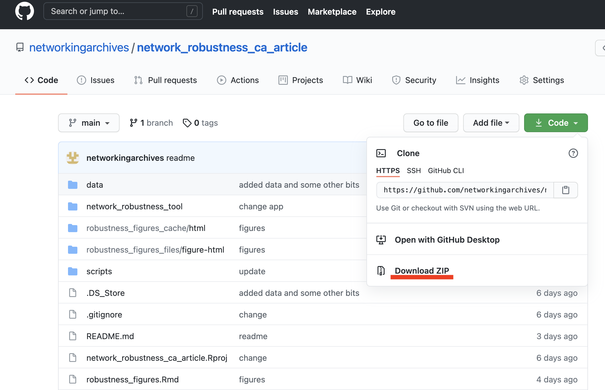
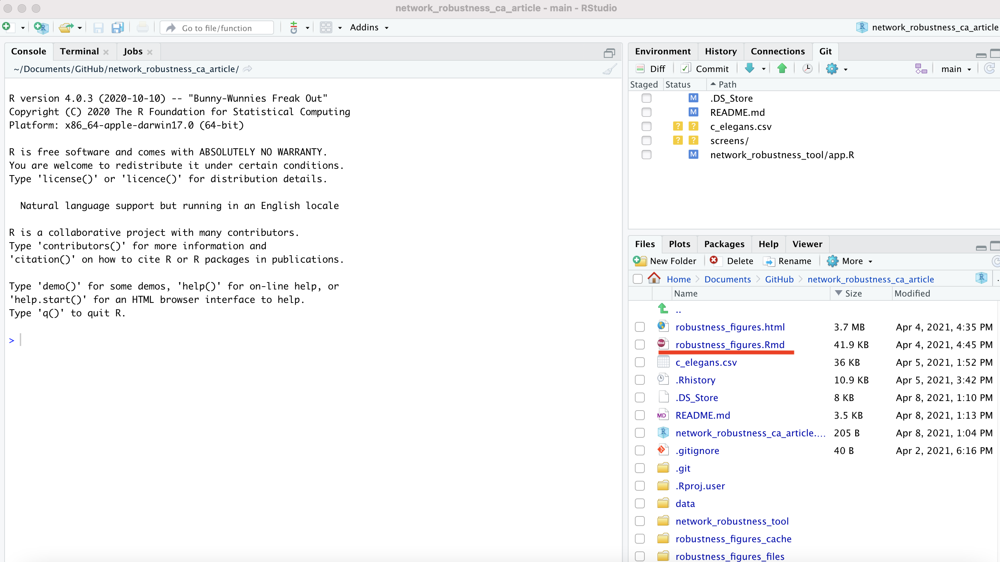
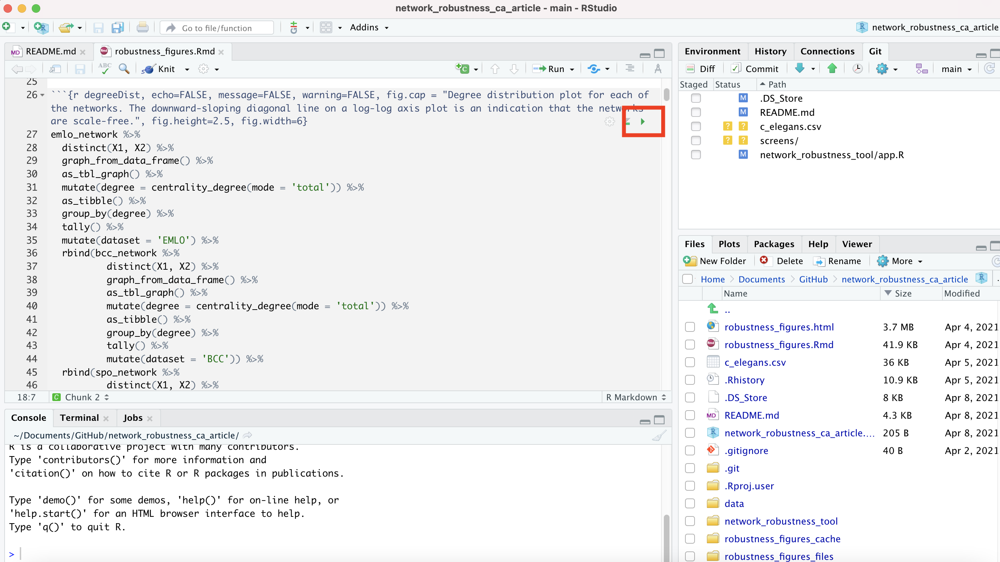

# Network Robustness article repository  

## Code and text for article on network measure robustness

This repository contains the code and data necessary to reproduce results published in <insert link here>. In this paper we removed progressively larger portions of three early modern correspondence networks (which are included here as edge lists, ultimately derived from correspondence metadata). 

The scripts folder contains code is divided into three parts:

* robustness_data.R, which generates the three standardised edge lists (with additional information) which form the basis of the results. Because the data is from an ongoing project, we prefer not to release the full underlying archive until the project's completion. We have scrambled the node IDs and provide the files which are the output of this first pre-processing script. The full data files will be published alongside a data paper in due course, and at that point this first script will make the code fully reproducible from start to finish.

* robustness_code.R - code for the three functions, one to generate a table of correlations for a range of network metrics between a sample and full network , a second which generates a list of sample networks of progressively smaller sizes and applies the first function to the list, and a third which does the same as the second with some adjustments to sample by node rather than by an attribute of an edge.  The code makes use of the C++ backend with data.table and parallel computing with furrr to speed things up. 

* robustness_final.R - loads the three pre-processed datasets, applies the functions described above to them to generate the robustness results, and does some data wrangling to knit the files together in final form to be used for figures in the manuscript.

* disambiguation_robustness.R: a separate script to reproduce the results of the experiment which added random disambiguation errors. The data for this is large (8GB unzipped) and has not been included.

The folder network_robustness_tool contains the source code for a Shiny app which generates robustness results from a user-uploaded edge list. Each additional column in the edge list is treated as an attribute of the edge and is sampled randomly too. So for example if the edge list has a letter ID, a catalogue name and a year, the code will produce robustness results using each of these as the basis for sampling. If run locally in R (recommended), you can remove the limit of 1000 edges and 20 runs - look for the relevant comments in the app source code. 

robustness_figures.Rmd contains the R markdown for code to generate all figures using ggplot2 - using the results generated by robustness_final.R.

The data folder contains both of the the scrambled edge lists necessary to produce the outputs. These can be re-run, though note that running the code across all datasets may take several days. 

We include the outputs we generated from the scripts necessary to re-create the figures. A random seed was not set in the original run, and as it uses random sampling, it is expected that a slightly different of results will be generated each time, though the overall pattern should remain the same. 
## To reproduce the results:

* Download R-Studio Desktop, following the instructions to install R first of all.

* Clone this repository, either through Git directly, or, more simply, just download the whole thing as a ZIP file:

* Extract the ZIP if necessary.

* Open 'network_robustness_ca_article.Rproj', which should automatically open the project in R-Studio.

* The bottom-right window pane contains all the files in the repository. If you want to produce the figures with the pre-generated data, open 'robustness_figures.Rmd'.

* This document should open in the top-left pane. It's an R Markdown document, containing regular text and snippets of code. If you have just installed R-Studio, it will prompt you to install the necessary libraries to run the markdown file. 

* To run each snippet of code and generate the figures, click on the little play triangle on the top-right corner of each code snippet. They'll need to be run in order, as later figures may depend on variables generated earlier:

* If you want to re-generate the results, open the scripts folder, and then the file 'robustness_code.R. If you click on 'Source' in the top right of this document, it'll run **all** the code in the script, and make the necessary functions available. Next, open 'robustness_final.R' and again click 'Source'. This will run the data through the necessary functions and generate all the robustness results, and merge them into a single file. This will take a long time - probably overnight or longer, depending on the speed of your computer. 

